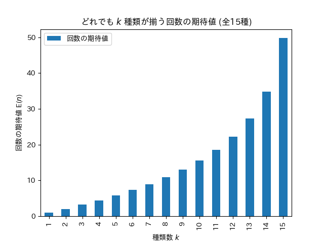
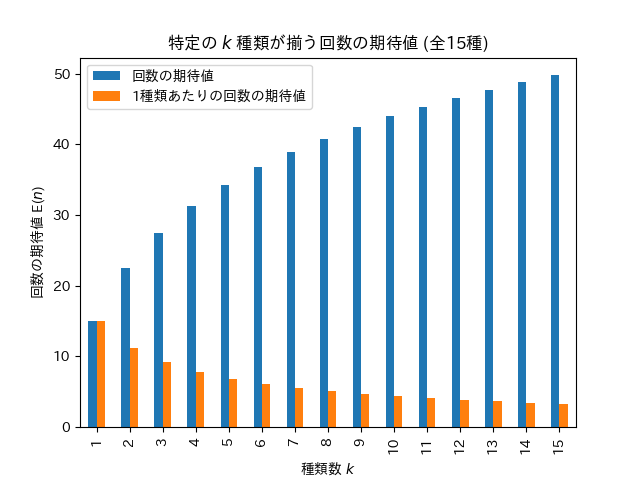
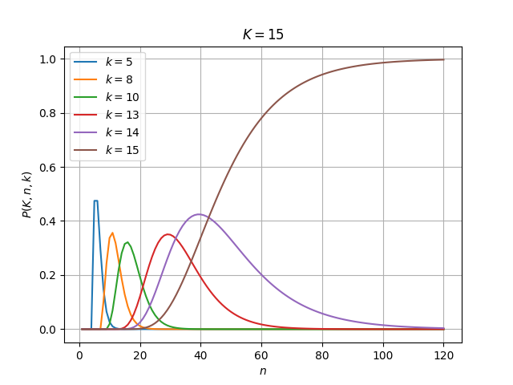

クーポンコレクター問題の例です。
海洋堂がイギリス大英博物館の収蔵物をミニチュア化した「大英博物館公式フィギュア」を2004年に発売しました。
15種類のフィギュアが、博物館の売店で販売されるクッキーのおまけとして付属していました。
購入時にどのフィギュアが出るのかわからず、どのフィギュアも同じ確率 $p=\frac{1}{15}$ で出るとします。


# 購入回数の期待値 E($n$)

購入回数の期待値は、おなじような条件で購入した人をたくさん集め、
それぞれの購入回数を合計して、それを人数で割った値(平均値)と考えることができます。

## (1) 全種類が揃うまでの購入回数の期待値 E($n$)

何回くらい購入すれば全種集められそうか知りたいとします。
全15種類が揃うまでの購入回数の期待値 E($n$) は次のとおりです。

| 全15種類揃う回数の期待値(E) |     **49.77** |

[計算の詳細](#計算-1-全種類が揃うまでの購入回数の期待値-en)


当例題から離れた一般的な話として、転売の問題などがない条件で経済行動の視点から考えますと、
もし市場で全15種類セットが49.77倍未満の価格で取引されているなら、
通常購入を繰り返して15種類揃えるよりも安いという考え方もあるかもしれません。
1種類あたりの倍率は約3.3倍です。


もし50個購入して全種到達した場合、約35個(50-15=35)の重複が発生しそうです。


## (2) どれでも $k$ 種類が揃う購入回数の期待値 E($n$)

すでに何個か購入した後、揃った種類数が平均よりいいかどうか知りたいとします。
全15種類のうちどれでもいいから $k$ 種類が揃うまでの購入回数の期待値 E($n$) を考えます。
種類数 $k=7$ (全体の約半分)、 $k=13$ (残りあと2種)、 $k=14$ (残りあと1種)のときの購入回数の期待値は、それぞれ次のとおりです。

|   種類数(k) |   k種揃う回数の期待値(E) |
|---------:|----------------:|
|        7 |          9.0056 |
|       13 |         27.2734 |
|       14 |         34.7734 |

種類数 $k=1$ から $k=15$ までをグラフにします。



[計算と数値の詳細](#計算-2-どれでも-k-種類が揃う購入回数の期待値-en)


## (3) 特定の $k$ 種類が揃う購入回数の期待値 E($n$)

途中まで購入した後に、不足している残りの $k$ 種が出るまでの回数を知りたいときなど、
全15種のうち特定の $k$ 種類が揃うまでの購入回数の期待値 E($n$) は次のとおりです。
この期待値は、不足している種を市場で取引するときの価格に関係しますので、
1個あたりの価格相当の意味で回数の期待値を種類数で割った値もあわせて出しています。

|   種類数(k) |   特定k種揃う回数の期待値(E) |   1種類あたりの回数の期待値(E/k) |
|---------:|------------------:|---------------------:|
|        1 |           15.0000 |              15.0000 |
|        2 |           22.5000 |              11.2500 |
|        3 |           27.5000 |               9.1667 |
|        5 |           34.2500 |               6.8500 |
|        8 |           40.7679 |               5.0960 |


例えば市場価格が通常価格の5倍のとき、7種類を通常購入で揃えた後に残り8種類を市場調達する方法が考えられます。

種類数 $k=1$ から $k=15$ までをグラフにします。



[計算と数値の詳細](#計算-3-特定の-k-種類が揃う購入回数の期待値-en)


## 計算の詳細


### [計算] (1) 全種類が揃うまでの購入回数の期待値 E($n$)

$K$ 種類の等確率の選択肢を $n$ 回引くとき、全種類が揃う回数 $n$ の期待値 E($n$)

$$ {\rm E}(n) \medspace = \medspace K \cdot H(K) $$

$H(n)$ は 調和数 ([wikipedia](https://ja.wikipedia.org/wiki/%E8%AA%BF%E5%92%8C%E6%95%B0_(%E7%99%BA%E6%95%A3%E5%88%97))) です。

pythonでsympyを使用して計算するコード例です。

```python
from sympy import harmonic

nk = 15
n =  nk * harmonic(nk)
print(float(n), float(n/nk))
```

```
49.7734348984349 3.3182289932289932
```

[項目に戻る⤴](#1-全種類が揃うまでの購入回数の期待値-en)

### [計算] (2) どれでも $k$ 種類が揃う購入回数の期待値 E($n$)

$K$ 種類の等確率の選択肢を $n$ 回引くとき、
$K$ 種類のうちどれでもいいから $k$ 種類が揃うまでの購入回数 $n$ の期待値 E($n$)

$$ {\rm E}(n) \medspace = \medspace K \thinspace \sum_{m=0}^{k-1} \frac{1}{K-m} $$

```python
import tabulate

nk = 15
ks = range(1, nk+1)
a = lambda _nk, k: sum( _nk/(_nk-m) for m in range(0, k) )
table = [ [k, a(nk, k)] for k in ks ]
headers = [ '種類数(k)', 'k種揃う回数の期待値(E)' ]
print(tabulate.tabulate( table, headers, tablefmt="pipe", floatfmt=["",".4f"] ))
```

|   種類数(k) |   k種揃う回数の期待値(E) |
|---------:|----------------:|
|        1 |          1.0000 |
|        2 |          2.0714 |
|        3 |          3.2253 |
|        4 |          4.4753 |
|        5 |          5.8389 |
|        6 |          7.3389 |
|        7 |          9.0056 |
|        8 |         10.8806 |
|        9 |         13.0234 |
|       10 |         15.5234 |
|       11 |         18.5234 |
|       12 |         22.2734 |
|       13 |         27.2734 |
|       14 |         34.7734 |
|       15 |         49.7734 |

グラフ作成

```python
import pandas as pd
import matplotlib.pyplot as plt
import japanize_matplotlib

nk = 15
ks = range(1, nk+1)
a = lambda nk, k: sum( nk/(nk-m) for m in range(0, k) )
cols = { '回数の期待値': [ a(nk, k) for k in ks ] }
df = pd.DataFrame(cols, index=ks)
df.plot.bar(title=f'どれでも $k$ 種類が揃う回数の期待値 (全{nk}種)', xlabel='種類数 $k$', ylabel='回数の期待値 E($n$)')
plt.savefig('figure-15-mean.png')
```

[項目に戻る⤴](#2-どれでも-k-種類が揃う購入回数の期待値-en)


### [計算] (3) 特定の $k$ 種類が揃う購入回数の期待値 E($n$)

$K$ 種類の等確率の選択肢を $n$ 回引くとき、
$K$ 種類のうち特定の $k$ 種類が揃うまでの購入回数 $n$ の期待値 E($n$)

$$ {\rm E}(n) \medspace = \medspace K \thinspace \sum_{m=0}^{k-1} \frac{1}{k-m} $$

この式は $ K \sum_{m=K-k}^{K-1} \frac{1}{K-m} $ と変形でき、
$k$を置き換えると [全種が揃う期待値 E($n$)](#計算-1-全種類が揃うまでの購入回数の期待値-en) から
[どれでも $k$ 種類が揃う期待値](#計算-2-どれでも-k-種類が揃う購入回数の期待値-en) の部分を除いたものと等しくなります。

```python
import tabulate

nk = 15
ks = range(1, nk+1)
a = lambda nk, k: sum( nk/(k-m) for m in range(0, k) )
table = [ [k, a(nk, k), a(nk, k)/k ] for k in ks ]
headers = [ '種類数(k)', '特定k種揃う回数の期待値(E)', '1種類あたりの回数の期待値(E/k)' ]
print(tabulate.tabulate( table, headers, tablefmt="pipe", floatfmt=["",".4f",".4f"] ))
```

|   種類数(k) |   特定k種揃う回数の期待値(E) |   1種類あたりの回数の期待値(E/k) |
|---------:|------------------:|---------------------:|
|        1 |           15.0000 |              15.0000 |
|        2 |           22.5000 |              11.2500 |
|        3 |           27.5000 |               9.1667 |
|        4 |           31.2500 |               7.8125 |
|        5 |           34.2500 |               6.8500 |
|        6 |           36.7500 |               6.1250 |
|        7 |           38.8929 |               5.5561 |
|        8 |           40.7679 |               5.0960 |
|        9 |           42.4345 |               4.7149 |
|       10 |           43.9345 |               4.3935 |
|       11 |           45.2982 |               4.1180 |
|       12 |           46.5482 |               3.8790 |
|       13 |           47.7020 |               3.6694 |
|       14 |           48.7734 |               3.4838 |
|       15 |           49.7734 |               3.3182 |

グラフ作成

```python
import pandas as pd
import matplotlib.pyplot as plt
import japanize_matplotlib

nk = 15
ks = range(1, nk+1)
a = lambda nk, k: sum( nk/(k-m) for m in range(0, k) )
cols = { '回数の期待値': [ a(nk, k) for k in ks ] }
cols = { '回数の期待値': [ a(nk, k) for k in ks ], '1種類あたりの回数の期待値': [ a(nk, k)/k for k in ks ] }
df = pd.DataFrame(cols, index=ks)
df.plot.bar(title=f'特定の $k$ 種類が揃う回数の期待値 (全{nk}種)', xlabel='種類数 $k$', ylabel='回数の期待値 E($n$)')
plt.savefig('figure-15-selected-mean.png')
```

[項目に戻る⤴](#3-特定の-k-種類が揃う購入回数の期待値-en)


## $k$ 種類が揃う確率 P$(K,n,k)$

$K$ 種類の等確率の選択肢を $n$ 回引くとき、$k$ 種類が揃う確率 P$(K,n,k)$

$$ {\rm P}(K,n,k) \medspace = \medspace \frac{1}{K^n} \thinspace (K)_{k} \thinspace { n \brace k } $$

$(x)_{n}$ は下降階乗冪([wikipedia](https://ja.wikipedia.org/wiki/%E9%9A%8E%E4%B9%97%E5%86%AA))、
${n \brace k}$ は第2種スターリング数([wikipedia](https://ja.wikipedia.org/wiki/%E3%82%B9%E3%82%BF%E3%83%BC%E3%83%AA%E3%83%B3%E3%82%B0%E6%95%B0)) です。

```python
from sympy import ff, functions
import tabulate

nk = 15
ks = [ 13, 14, 15 ]
ns = list(range(15, 50+1, 5)) + list(range(60, 100+1, 10))
a = lambda nk,n,k: ff(nk,k) * functions.combinatorial.numbers.stirling(n,k) / nk**n
table = [ ([n] + [a(nk, n, k) for k in ks]) for n in ns ]
headers = [ f'引く回数(n)' ] + [ f'{k}種揃う確率(P)' for k in ks ]
print(tabulate.tabulate(table, headers, tablefmt="pipe", floatfmt=[""]+[".6f"]*len(ks)))
```

|   引く回数(n) |   13種揃う確率(P) |   14種揃う確率(P) |   15種揃う確率(P) |
|----------:|-------------:|-------------:|-------------:|
|        15 |     0.006794 |     0.000314 |     0.000003 |
|        20 |     0.120078 |     0.024785 |     0.001779 |
|        25 |     0.296440 |     0.134428 |     0.022265 |
|        30 |     0.349311 |     0.288728 |     0.087836 |
|        35 |     0.286460 |     0.396035 |     0.200427 |
|        40 |     0.192449 |     0.424090 |     0.338178 |
|        45 |     0.115006 |     0.392073 |     0.476448 |
|        50 |     0.063976 |     0.330862 |     0.599395 |
|        60 |     0.017578 |     0.201787 |     0.779972 |
|        70 |     0.004465 |     0.110707 |     0.884754 |
|        80 |     0.001096 |     0.057905 |     0.940990 |
|        90 |     0.000265 |     0.029625 |     0.970109 |
|       100 |     0.000064 |     0.015000 |     0.984936 |



```python
from sympy import ff, functions
import pandas as pd
import matplotlib.pyplot as plt

nk = 15
ks = [ 5, 8, 10, 13, 14, 15 ]
ns = range(1, 120+1)
a = lambda nk,n,k: ff(nk,k) * functions.combinatorial.numbers.stirling(n,k) / nk**n
cols = { f'$k = {k}$': [float(a(nk, n, k)) for n in ns] for k in ks }
pd.DataFrame(cols, index=ns).plot(grid=True, title=f'$K = {nk}$', xlabel='$n$', ylabel='$P(K,n,k)$')
plt.savefig('figure-15-prob-k.png')
```

#### 全種確率がqを超える実数回数n q=0.01から0.9999までいくつか nk=15

$K$ 種類の等確率の選択肢を $n$ 回引くとき、$k$ 種類が揃う確率 $P(K,n,k)$ の式を、数値計算しやすい形にします。

$$ {\rm P}(K,n,k) \medspace = \medspace \frac{1}{K^n} \frac{(K)\raisebox{-0.25em}{${\scriptsize k}$}}{k!} \sum_{m=1}^{k} (-1)^{k-m}  { k \choose m } \thinspace m^{n} $$

$(x)_{n}$ は下降階乗冪、${n \choose k}$ は二項係数です。
$n$ を実数とみなし、全種揃う $k=K$ の場合の確率 P が $q$ となる回数 $n$ を計算します。

```python
from sympy import var, ff, factorial, Sum, binomial, nsolve, harmonic
import tabulate

var('nk k n m')
f = ff(nk,k) / factorial(k) * Sum((-1)**(k-m) * binomial(k,m) * m**n, (m,1,k)) / nk**n
x0 = lambda _nk: _nk*harmonic(_nk)*(1/2 if _nk==3 else 1)
s = lambda _nk, q: nsolve(f.subs(k,nk).subs(nk,_nk) - q, n, x0(_nk))
qs = [0.0001, 0.001, 0.01, 0.1, 0.25, 0.5, 0.75, 0.8, 0.9, 0.95, 0.99, 0.999, 0.9999]
_nk = 15
table = [ [q, s(_nk, q)] for q in qs ]
headers = [ f'全{_nk}種揃う確率(q)', f'全{_nk}種揃う回数(n)' ]
print(tabulate.tabulate(table, headers, tablefmt="pipe", floatfmt=["",".2f"]))
```

|   全15種揃う確率(q) |   全15種揃う回数(n) |
|--------------:|--------------:|
|        0.0001 |         16.97 |
|        0.001  |         19.24 |
|        0.01   |         23.03 |
|        0.1    |         30.64 |
|        0.25   |         36.85 |
|        0.5    |         45.90 |
|        0.75   |         57.95 |
|        0.8    |         61.51 |
|        0.9    |         72.14 |
|        0.95   |         82.45 |
|        0.99   |        105.96 |
|        0.999  |        139.37 |
|        0.9999 |        172.75 |
